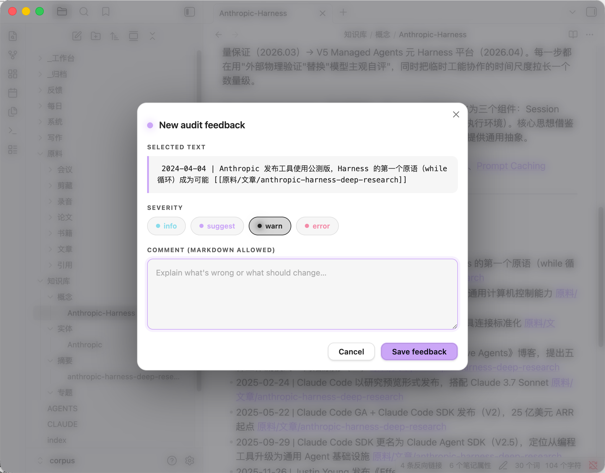

# lorekit

A personal LLM Wiki toolkit — let AI build and maintain your knowledge base.

Based on [Karpathy's LLM Wiki pattern](https://gist.github.com/karpathy/442a6bf555914893e9891c11519de94f), lorekit gives any AI coding agent (Claude Code / Codex / Cursor / Kimi CLI / Aider / Windsurf) a local knowledge-base workflow: **raw sources → LLM compilation → persistent wiki**. Compile once, keep updating — no RAG.

> **Hand the GitHub link to your AI, say "install this for me" — it reads CLAUDE.md / AGENTS.md and does the rest.**

## Core Idea

> "Instead of just retrieving from raw documents at query time, the LLM incrementally builds and maintains a persistent wiki." — [Andrej Karpathy](https://gist.github.com/karpathy/442a6bf555914893e9891c11519de94f)

Traditional RAG: every query re-retrieves from raw documents. Nothing accumulates.

lorekit (LLM Wiki): the LLM incrementally compiles raw material into a structured wiki. Knowledge is compiled once and continuously updated — cross-references in place, contradictions flagged, every source reflected.

Three layers:

- **Raw layer** (`原料/`): read-only source material, the LLM never mutates it
- **Artifact layer** (`知识库/`): the compiled wiki — cross-linked, synthesized, continuously updated
- **Schema** (`CLAUDE.md` / `AGENTS.md`): per-corpus configuration, co-maintained by human + LLM

> **Data safety**: lorekit has zero tolerance for data loss. Existing notes are backed up before init; `原料/` is immutable; no `rm` is ever used — deletions go through `trash` (recoverable from macOS Trash). See the data-safety rules in CLAUDE.md.

## Feature Map

| Feature | Command | Notes |
|---|---|---|
| Launch screen | `lorekit` | No-arg invocation prints the blue logo + corpus status |
| Init | `lorekit init` | Scaffolds the corpus, deploys the Obsidian plugin, auto-backs up pre-existing content |
| Doctor | `lorekit doctor` | Directory integrity, frontmatter coverage, stale workbench reminders |
| Stats | `lorekit stats` | Page count, type breakdown |
| Search | `lorekit search` | Text search + vector semantic search (hybrid) |
| Web fetch | `lorekit fetch <url>` | Pulls WeChat / generic pages into the workbench; auto-extracts `publishDate`, writes spec-compliant frontmatter, detects duplicate / in-progress URLs from state.json |
| Ingest state | `lorekit ingest <sub>` | `list` / `pending` / `record` / `forget` / `reconcile` — the single source of truth for ingest pipeline progress |
| Lint | `lorekit lint` | Broken wikilinks, orphan pages, duplicate detection |
| Snapshot | `lorekit snapshot` | Full-corpus tarball + manifest |
| Restore | `lorekit restore` | Recover missing / changed files from a snapshot |
| Audit | `lorekit audit` | Create / list / resolve human feedback on wiki pages |
| Vector sync | `lorekit vector sync` | Incrementally embed the corpus into sqlite-vec |
| Vector query | `lorekit vector query` | Vector search with optional L0 / L1 / L2 layering |
| Vector status | `lorekit vector status` | Inspect the vector index |
| Directory index | `lorekit index` | Generate / refresh `_INDEX.md` files per subdirectory |

> The CLI is named `lorekit`. The 6 Agent Skills keep the `wiki-` prefix (a nod to Karpathy's LLM Wiki): `wiki-ingest` / `wiki-query` / `wiki-fileback` / `wiki-lint` / `wiki-enrich` / `wiki-audit`.

## Ingest Pipeline (single-source-of-truth state machine)

Every ingest is tracked in `<corpus>/.wiki/ingest-state.json`. This file is the **only** authority on pipeline progress — no filesystem scans, no duplicate heuristics.

**Three top-level states**: `started` / `completed` / `failed`.

Fine-grained progress is tracked in a `stepsDone[]` array so an interrupted ingest can resume exactly where it left off. The top-level status only changes when the pipeline as a whole ends.

```json
{
  "version": 1,
  "ingests": {
    "https://example.com/post": {
      "url": "https://example.com/post",
      "title": "…",
      "sourceDate": "2026-04-15",
      "status": "started",
      "stepsDone": ["fetch", "archive", "wiki"],
      "archivedTo": "原料/文章/post",
      "wikiPages": ["知识库/概念/foo.md"],
      "startedAt": "2026-04-17T10:00:00.000Z",
      "updatedAt": "2026-04-17T10:05:00.000Z"
    }
  }
}
```

**Status transitions** driven by `lorekit ingest record --step <X>`:

| Action | `status` | `stepsDone` |
|---|---|---|
| `lorekit fetch <url>` (success) | `started` | `[fetch]` |
| `lorekit ingest record <url> --step archive` | `started` | `[fetch, archive]` |
| `lorekit ingest record <url> --step wiki` | `started` | `[fetch, archive, wiki]` |
| `lorekit ingest record <url> --step lint` | **`completed`** | `[fetch, archive, wiki, lint]` |

Only `--step lint` auto-promotes to `completed`. Every other `--step` keeps the top status at `started` — all progress detail lives in `stepsDone`. Explicit `--complete` and `--fail <reason>` are also available.

**What `lorekit fetch` does before hitting the network**, consulting state.json:

- Record with `status: completed` → returns `{"status":"duplicate", duplicate}`, does not re-fetch
- Record with `status: started` → returns `{"status":"in_progress", ingestState, nextStep}`, does not re-fetch
- No record, but a matching `source_url` exists in `原料/` → same `duplicate` path (legacy fallback)
- Otherwise → fetches normally, writes `status: started, stepsDone: [fetch]`

`--force` bypasses every check.

**Extensibility** — adding a new step (e.g. `embed`) is just appending `"embed"` to `stepsDone`. The status enum stays at three. No switch-case in the caller needs to change.

## Quick Start

### Option 1: let AI install it (recommended)

Send the repo link to your AI coding agent and say "install this project." It reads `CLAUDE.md` / `AGENTS.md` and runs: dependency check → clone → build → link → init corpus → install skills.

### Option 2: manual install

```bash
# 1. Clone
git clone https://github.com/GYF0311/lorekit.git ~/code/lorekit

# 2. Install deps + build
cd ~/code/lorekit && npm install && npm run build

# 3. Link to global PATH
npm link

# 4. Verify
lorekit --version   # → 0.2.0
lorekit             # no-arg invocation shows the brand banner

# 5. Initialize a corpus
lorekit init ~/Desktop/my-corpus

# 6. Install Agent Skills
lorekit install-skills --target claude-code

# 7. Start a conversation from the corpus directory
cd ~/Desktop/my-corpus
claude  # or codex / cursor / kimi …
```

(Future: once published to npm, `npm install -g lorekit` will be enough.)

### Dependencies

| Tool | Purpose | Install | Required |
|---|---|---|---|
| Node.js ≥ 18 | JS runtime | `brew install node` | ✅ |
| git | Version control | ships with macOS/Linux | ✅ |
| ripgrep | Text-search acceleration | `brew install ripgrep` | Optional |
| ollama | Local embedding runtime | `brew install ollama` | Optional |
| bge-m3 | Embedding model | `ollama pull bge-m3` | Optional |

**Only Node.js is required.** No bash / Python / uv / pip. lorekit is pure TypeScript, cross-platform (macOS / Linux / Windows).

Vector retrieval is optional — without ollama, the AI still navigates via `index.md`.

## Using It

```bash
cd ~/Desktop/my-corpus
claude  # or codex / cursor / kimi …
```

Talk in natural language; the AI routes to the right skill:

```
> Ingest this article: https://mp.weixin.qq.com/s/xxx
# → wiki-ingest: fetch → store in 原料/ → compile into 知识库/ → update index.md

> Have I filed anything about RAG before?
# → wiki-query: read index.md → locate pages → synthesize answer

> Save that analysis into the knowledge base
# → wiki-fileback: route to the right wiki page by subject

> Check the health of the knowledge base
# → wiki-lint: scan broken links, orphans, stale workbench

> Back up the corpus
# → lorekit snapshot → .wiki/snapshots/xxx.tar.gz
```

## Vector Retrieval

Default stack: **[ollama](https://ollama.com/) + [bge-m3](https://huggingface.co/BAAI/bge-m3)** (BAAI, 1024-d, 100+ languages, strong on Chinese+English).

Embeddings are produced through ollama's local API. **No torch, no pip, no API key, nothing leaves your machine.**

```bash
# One-time setup
brew install ollama
ollama pull bge-m3

# Incremental index
lorekit vector sync

# Semantic query
lorekit vector query --text "relationship between RAG and LLM wikis"

# Layered retrieval (L0 dir → L1 page → L2 chunk)
lorekit vector sync --layered
lorekit vector query --text "xxx" --layered
```

Swappable embedding models (any ollama-hosted model works):

| Model | Install | Size | Dim | Best for |
|---|---|---|---|---|
| **bge-m3** (default) | `ollama pull bge-m3` | 1.2 GB | 1024 | Chinese+English, balanced |
| nomic-embed-text | `ollama pull nomic-embed-text` | 274 MB | 768 | English-heavy, lightweight |
| mxbai-embed-large | `ollama pull mxbai-embed-large` | 670 MB | 1024 | Strong English |
| all-minilm | `ollama pull all-minilm` | 45 MB | 384 | Ultra-lightweight |

## Progressive Disclosure

The agent's context window is scarce. lorekit uses three-layer progressive disclosure on both the document side and the vector side, reading only what's needed.

### Document retrieval (L0 → L1 → L2)

```
L0 (auto-injected, ~2k tokens)
  CLAUDE.md + index.md
  → Agent immediately knows "what this corpus is and what each page roughly covers"

      ↓ pick the right subdirectory

L1 (on-demand, ~1k tokens/pull)
  知识库/概念/_INDEX.md
  → the full entry list for one shelf

      ↓ narrow to a specific page

L2 (targeted)
  知识库/概念/RAG.md
  → full page content

      ↓ still not enough?

L3 (semantic fallback)
  lorekit vector query
  → vector search as last resort
```

Like a human looking for a book: floor directory (L0) → shelf (L1) → take the book off the shelf (L2) → ask the librarian (L3). Total budget typically < 5k tokens.

### Vector retrieval (layered, `--layered` opt-in)

The vector index itself is three tables in `.wiki/vector.sqlite`:

```
L0: directory-level (vec_dirs)
  One "directory summary vector" per subdirectory
  Coarse filter: "which shelf is this question on?"

      ↓ drill into the top-3 shelves only

L1: page-level (vec_pages)
  Encodes title + Compiled Truth lead paragraph of each wiki page
  "Which book?"

      ↓ scan the top-5 pages only

L2: chunk-level (vec_chunks)
  Each page split at `## headings`, each chunk encoded
  "Which paragraph?"
```

Off by default (for small corpora `index.md` is enough). Enable for 500+ pages:

```bash
lorekit vector sync --layered
lorekit vector query --text "xxx" --layered
```

Same philosophy as hybrid retrieval (keyword coarse filter → vector rerank). lorekit keeps it simple — no rerank model, just layered embeddings.

## Corpus Layout

```
corpus/
├── CLAUDE.md           ← per-corpus schema (auto-loaded by AI agents)
├── AGENTS.md           ← mirror of CLAUDE.md for Codex / Kimi / GPT
├── index.md            ← wiki table of contents (LLM updates on each ingest)
├── log.md              ← operation timeline (append-only)
│
├── 原料/               ← Raw sources (read-only, immutable)
│   ├── 文章/           ← web articles
│   ├── 论文/           ← academic papers
│   ├── 书籍/           ← book notes
│   ├── 会议/           ← meeting notes
│   ├── 录音/           ← transcribed audio
│   ├── 剪藏/           ← WeChat / web clippings
│   └── 引用/           ← pointers to large external files
│
├── 知识库/             ← Wiki (LLM-compiled artifact layer)
│   ├── 概念/           ← mental models, methodologies
│   ├── 实体/           ← people, tools, orgs, projects
│   ├── 摘要/           ← per-source summaries
│   └── 专题/           ← cross-source thematic syntheses (optional)
│
├── 每日/               ← daily notes (YYYY-MM-DD.md)
├── 写作/               ← outgoing drafts
│
├── 反馈/               ← human-feedback loop (Obsidian plugin + CLI)
│   ├── 待处理/
│   └── 已处理/
│
├── _工作台/            ← workbench (TTL-driven)
│   ├── 收件/           ← 7 days
│   ├── 草稿/           ← 30 days
│   ├── 临时/           ← 14 days
│   └── 待整理/         ← 3 days
│
├── _归档/              ← cold storage
└── .wiki/              ← lorekit metadata
    ├── ingest-state.json   ← ingest pipeline single source of truth
    ├── vector.sqlite       ← vector index (optional)
    └── snapshots/          ← snapshot archives
```

Subdirectory layout under `知识库/` is not fixed — it's declared by `CLAUDE.md` and can be customized per use case.

## Customization

lorekit is a skeleton, not a fixed structure:

1. **Edit `CLAUDE.md` scope** — declare what the corpus covers and doesn't
2. **Adjust `知识库/` subdirectories** — interview use case adds `知识库/面经/`, reading use case swaps for `知识库/角色/章节/`, etc.
3. **Edit filing rules** — append routing rules in `系统/filing-rules.md`
4. **Swap the embedding model** — `lorekit vector sync --model <ollama-model-name>`

## Backup & Restore

```bash
# Create a snapshot
lorekit snapshot --tag before-migration

# See what would change (no mutation)
lorekit restore --from .wiki/snapshots/xxx.tar.gz --dry-run

# Restore
lorekit restore --from .wiki/snapshots/xxx.tar.gz
```

`lorekit init` also offers backup automatically when it detects pre-existing content.

## Obsidian Integration

`lorekit init` deploys the `lorekit-audit` Obsidian plugin to `corpus/.obsidian/plugins/`. Enable it in Settings → Community plugins.

### Leaving feedback (shortcut `Cmd + '`)

Open any wiki page, select some text, press `Cmd + '` (or run "Add feedback on selection" from the command palette):



Four severity levels:

| Level | Meaning |
|---|---|
| `info` | Additional context, not an error |
| `suggest` | Improvement suggestion |
| `warn` | Needs attention |
| `error` | Must fix |

Click **Save feedback** → written to `反馈/待处理/<timestamp>-<slug>.md` with anchor context (resilient to page edits).

### Resolving feedback

```bash
lorekit audit --list              # list all feedback
lorekit audit --list --open       # open items only
```

Or in Claude Code say "process the feedback" → the agent triggers `wiki-audit`: read `反馈/待处理/` entries → fix by severity → move to `反馈/已处理/` with a resolution note.

### Other niceties

- `[[wikilinks]]` are clickable in Obsidian
- Graph view visualizes the knowledge network
- Plugin writes to `反馈/待处理/` by default — no config needed

## Project Layout

```
lorekit/
├── bin/
│   └── lorekit.js           Node.js CLI entry
├── src/                     TypeScript sources
│   ├── cli.ts               command dispatch + banner
│   ├── commands/            subcommand implementations
│   ├── lib/                 core library (corpus / ollama / vectordb / chunker / fetcher / ingest-state)
│   └── utils/               logger, fs helpers
├── dist/                    tsup build output (committed so users don't need to build)
├── skills/                  Agent Skills (plain markdown, agent-agnostic)
│   ├── wiki-ingest/
│   ├── wiki-query/
│   ├── wiki-fileback/
│   ├── wiki-lint/
│   ├── wiki-enrich/
│   └── wiki-audit/
├── plugins/
│   └── obsidian-audit/      Obsidian audit plugin
├── templates/
│   └── default-corpus/      corpus scaffold template
├── docs/
│   └── QUICKSTART.md        30-minute onboarding guide
├── package.json
├── tsconfig.json
├── tsup.config.ts
├── CLAUDE.md                auto-install instructions for Claude Code
└── AGENTS.md                auto-install instructions for Codex / Kimi / GPT
```

## Acknowledgements

lorekit would not exist without the following projects and people.

### Core inspiration

| Source | Author | Contribution |
|---|---|---|
| [LLM Wiki Gist](https://gist.github.com/karpathy/442a6bf555914893e9891c11519de94f) | **Andrej Karpathy** | The core idea — three-layer architecture (raw / wiki / schema), the ingest / query / lint triad, the philosophy that "the wiki is a compilation cache, not the content itself." lorekit's soul comes from this gist. |
| [llm-wiki-skill](https://github.com/lewislulu/llm-wiki-skill) | **Lewis Liu** | Audit feedback system design, Obsidian audit plugin, references-doc structure. lorekit's `反馈/` directory and audit plugin directly reference this project. |

### Referenced projects

| Project | Author | Contribution |
|---|---|---|
| [OpenViking](https://github.com/nicepkg/OpenViking) | **nicepkg** | Context Database design, inspired lorekit's layered vector retrieval |

### Key dependencies

| Project | Author | Purpose |
|---|---|---|
| [bge-m3](https://huggingface.co/BAAI/bge-m3) | **BAAI** | Default embedding model (1024-d, 100+ languages) |
| [sqlite-vec](https://github.com/asg017/sqlite-vec) | **Alex Garcia** | Vector storage (single-file sqlite extension) |
| [ollama](https://github.com/ollama/ollama) | **Ollama Inc.** | Local model inference, zero-config embedding API |
| [qmd](https://github.com/tobi/qmd) | **Tobi Lütke** (Shopify CEO) | Karpathy-endorsed local markdown search — our search design references it |

### Indirect influences

| Source | Influence |
|---|---|
| Vannevar Bush, "As We May Think" (1945) | The Memex concept Karpathy cites — curated personal knowledge where the links matter more than the documents |
| ByteDance RAG field guide | Chunking strategies, hybrid-retrieval engineering |
| Coze Studio source | Four-step knowledge-base pipeline design |
| [MTEB Leaderboard](https://huggingface.co/spaces/mteb/leaderboard) | Embedding-model selection |

### Design principles

| Principle | Origin |
|---|---|
| "Thin CLI, fat skills" | Garry Tan (YC CEO) — latent judgment in markdown |
| "Filesystem is all you need" | Unix philosophy + Obsidian's plain-file design |
| "Compiled Truth + Timeline" | Wikipedia — editable body + append-only history |
| Per-corpus CLAUDE.md / AGENTS.md | Karpathy's schema concept + Claude Code / Codex conventions |

## License

MIT
