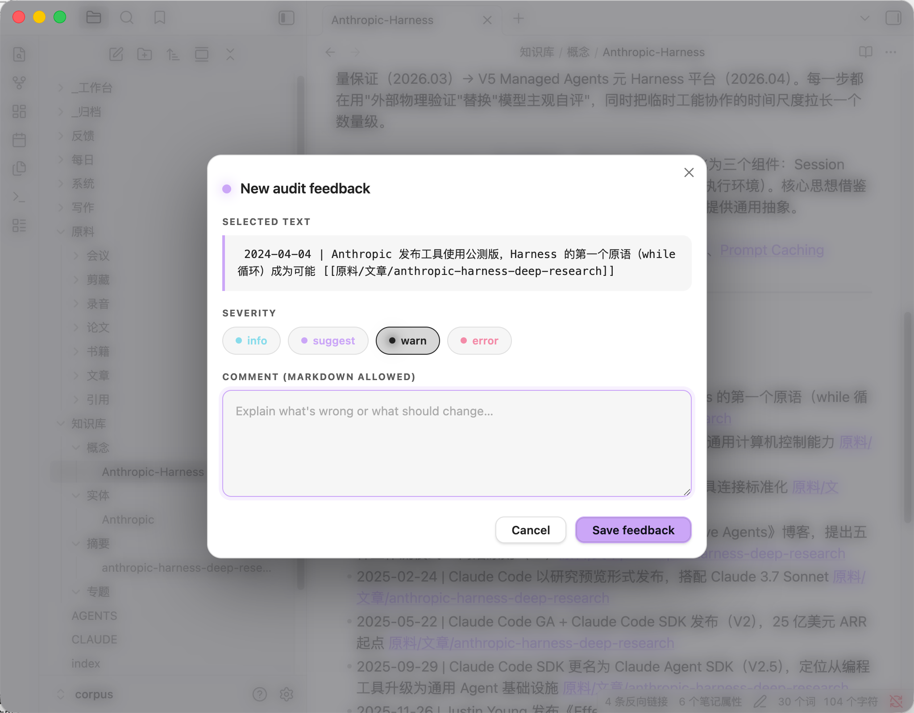

# lorekit

A personal LLM Wiki toolkit — let AI build and maintain your knowledge base.

Based on [Karpathy's LLM Wiki pattern](https://gist.github.com/karpathy/442a6bf555914893e9891c11519de94f), lorekit gives any AI coding agent a local knowledge-base workflow: **raw sources → LLM compilation → persistent wiki**. Compile once, keep updating — no RAG. The default install is just the `lorekit` CLI; project-local research skills and central-corpus routing are optional modules you can add when your workflow needs them.

> **Hand the GitHub link to your AI, say "install this for me" — it reads CLAUDE.md / AGENTS.md and does the rest.**

For a long-form feature introduction to the CLI, workflow, safety model, optional modules, and Obsidian experience, see [`docs/INTRODUCTION.md`](docs/INTRODUCTION.md).

## Core Idea

> "Instead of just retrieving from raw documents at query time, the LLM incrementally builds and maintains a persistent wiki." — [Andrej Karpathy](https://gist.github.com/karpathy/442a6bf555914893e9891c11519de94f)

Traditional RAG: every query re-retrieves from raw documents. Nothing accumulates.

lorekit (LLM Wiki): the LLM incrementally compiles raw material into a structured wiki. Knowledge is compiled once and continuously updated — cross-references in place, contradictions flagged, every source reflected.

Three layers:

- **Raw layer** (`原料/`): read-only source material, the LLM never mutates it
- **Artifact layer** (`知识库/`): the compiled wiki — cross-linked, synthesized, continuously updated
- **Schema** (`CLAUDE.md` / `AGENTS.md`): per-corpus configuration, co-maintained by human + LLM

Project-local evidence folders such as `_工作台/课程原文/` are not automatically part of the LM Wiki raw-source layer. The retrieval chain starts from `index.md` / `知识库/`; open `原料/` only when full source provenance is needed, and promote project evidence into `原料/` only through an explicit ingest. Doctor frontmatter coverage is calculated on durable layers by default; lint flags `知识库/**` pages that cite `_工作台/**` directly as a canonical source.

> **Data safety**: lorekit has zero tolerance for data loss. Existing notes are backed up before init; `原料/` is immutable; no `rm` is ever used — deletions go through `trash` (recoverable from macOS Trash). See the data-safety rules in `AGENTS.md` and `docs/INSTALLATION.md`.

## Feature Map

| Feature         | Command                 | Notes                                                                                                                                                                 |
| --------------- | ----------------------- | --------------------------------------------------------------------------------------------------------------------------------------------------------------------- |
| Launch screen   | `lorekit`               | No-arg invocation prints the blue logo + corpus status                                                                                                                |
| Init            | `lorekit init`          | Scaffolds the corpus, deploys the Obsidian plugin, auto-backs up pre-existing content                                                                                 |
| Doctor          | `lorekit doctor`        | Directory integrity, frontmatter coverage, Obsidian hints, enabled/explicit optional integration health; supports `--json` and strict `--section <name>` filters        |
| Stats           | `lorekit stats`         | Page count, type breakdown                                                                                                                                            |
| Search          | `lorekit search`        | Text search with ripgrep and built-in fallback                                                                                                                         |
| Web fetch       | `lorekit fetch <url>`   | Pulls WeChat / generic pages into the workbench; auto-extracts `publishDate`, writes spec-compliant frontmatter, detects duplicate / in-progress URLs from state.json |
| Ingest state    | `lorekit ingest <sub>`  | `list` / `pending` / `record` / `forget` / `reconcile` — the single source of truth for ingest pipeline progress                                                      |
| Lint            | `lorekit lint`          | Broken wikilinks, orphan pages, workbench-as-source links, duplicate detection; `--quick` is accepted as a compatibility alias for agent self-checks; backlogged missing nodes are surfaced but not counted |
| Links closure   | `lorekit links <sub>`   | suggest / fix / stub / backlog / plain / plained — deterministic broken-wikilink closure; backlogged labels are downgraded (not counted) by lint until the node is created                                  |
| Snapshot        | `lorekit snapshot`      | Full-corpus tarball + manifest                                                                                                                                        |
| Restore         | `lorekit restore`       | Recover missing / changed files from a snapshot                                                                                                                       |
| Remove          | `lorekit remove`        | Dry-run impact report, then safely move selected sources/pages to OS Trash with provenance-aware cleanup                                                              |
| Audit           | `lorekit audit`         | Create / list / resolve human feedback on wiki pages                                                                                                                  |
| Directory index | `lorekit index`         | Recursively generate `_INDEX.md` for every subdirectory (including folder-packaged sources like `原料/文章/<slug>/article.md`)                                        |
| **Sync**        | **`lorekit sync`**      | **One-shot for durable corpus changes: `_INDEX.md` → root `index.md` → `doctor`; supports `--json` and `--report` for agent-readable step receipts**                  |
| Obsidian tune   | `lorekit obsidian-tune` | 老用户升级一键应用 Obsidian graph filter（默认只读检查 / `--write` 备份后写 / `--print` 管道用）                                                                      |

> The CLI is named `lorekit`. Project-local Agent Skills keep the `wiki-` prefix (a nod to Karpathy's LLM Wiki), including `wiki-ingest`, `wiki-query`, `wiki-fileback`, `wiki-lint`, `wiki-audit`, `wiki-remove`, `wiki-triage`, and `wiki-output`. They operate on the current corpus/project and are the recommended skill layer for research corpora. Cross-project `corpus-*` skills and `wiki-daily` still exist, but they are explicit optional installs for users who deliberately maintain a central corpus or personal diary gateway.

## Ingest Pipeline (single-source-of-truth state machine)

Every ingest is tracked in `<corpus>/.wiki/ingest-state.json`. This file is the **only** authority on pipeline progress — no filesystem scans, no duplicate heuristics.

**Three top-level states**: `started` / `completed` / `failed`.

Fine-grained progress is tracked in a `stepsDone[]` array so an interrupted ingest can resume exactly where it left off. The top-level status only changes when the pipeline as a whole ends.

```json
{
  "version": 1,
  "ingests": {
    "https://example.com/post": {
      "url": "https://example.com/post",
      "title": "…",
      "sourceDate": "2026-04-15",
      "status": "started",
      "stepsDone": ["fetch", "archive", "wiki"],
      "archivedTo": "原料/文章/post",
      "wikiPages": ["知识库/概念/foo.md"],
      "startedAt": "2026-04-17T10:00:00.000Z",
      "updatedAt": "2026-04-17T10:05:00.000Z"
    }
  }
}
```

**Status transitions** driven by `lorekit ingest record --step <X>`:

| Action                                       | `status`        | `stepsDone`                    |
| -------------------------------------------- | --------------- | ------------------------------ |
| `lorekit fetch <url>` (success)              | `started`       | `[fetch]`                      |
| `lorekit ingest record <url> --step archive` | `started`       | `[fetch, archive]`             |
| `lorekit ingest record <url> --step wiki`    | `started`       | `[fetch, archive, wiki]`       |
| `lorekit ingest record <url> --step lint`    | **`completed`** | `[fetch, archive, wiki, lint]` |

Only `--step lint` auto-promotes to `completed`. Every other `--step` keeps the top status at `started` — all progress detail lives in `stepsDone`. Explicit `--complete` and `--fail <reason>` are also available.

**What `lorekit fetch` does before hitting the network**, consulting state.json:

- Record with `status: completed` → returns `{"status":"duplicate", duplicate}`, does not re-fetch
- Record with `status: started` → returns `{"status":"in_progress", ingestState, nextStep}`, does not re-fetch
- No record, but a matching `source_url` exists in `原料/` → same `duplicate` path (legacy fallback)
- Otherwise → fetches normally, writes `status: started, stepsDone: [fetch]`

`--force` bypasses every check.

**Extensibility** — adding a new step (e.g. `embed`) is just appending `"embed"` to `stepsDone`. The status enum stays at three. No switch-case in the caller needs to change.

## Install Routes

Default install is lorekit-only: install the global `lorekit` CLI and initialize a corpus. This is enough for fetch, ingest state, search, sync, doctor, snapshot, restore, safe remove, and Obsidian tuning. Skills and integrations are add-on modules, not part of the base route.

AI installer rule: if the user just says "install lorekit", recommend and run CLI-only first. Ask before adding project-local skills, central-corpus entrypoints, or diary automation, because each module adds concepts and configuration the user must maintain.

Composable modules:

| Module | Add when | Command / config | Extra learning cost |
| ------ | -------- | ---------------- | ------------------- |
| CLI only | You want the default route | no `install-skills`; use `lorekit init` + `lorekit doctor` | lowest |
| Agent skills | You want Claude Code / Codex to expose current-project lorekit workflows as named skills | `lorekit install-skills --target <claude-code\|codex>` | learn skill triggers |
| Project-local research skills | You want one corpus/project to carry its own `wiki-*` workflows and domain routes | `lorekit install-skills --target project --mode copy` | maintain project routes in `AGENTS.md` |
| Codex diary gateway | You want a personal diary / daily compile entrypoint | `lorekit install-skills --target codex --only wiki-daily --mode copy` + `~/.config/lorekit/daily.json` | maintain daily config |
| Central corpus entrypoints | You want any project to query / capture / ingest into one configured corpus | `lorekit install-skills --target codex --only corpus-query,corpus-capture,... --mode copy` + `~/.config/lorekit/global-corpus.json` | maintain central corpus routing |

For Codex personal diary use, install the optional daily workflow explicitly:

```bash
lorekit install-skills --target codex --only wiki-daily --mode copy
```

This copies `wiki-daily` into Codex's `~/.agents/skills` skill root. Configure its target corpus paths in `~/.config/lorekit/daily.json`.

Optional Feishu / Lark notifications can be enabled in `daily.json` so scheduled daily / rolling / weekly runs send a bot DM when fileback candidates need review. The message is a reminder only; copy its confirmation sentence back into Codex to approve specific `知识库/` writebacks.

For project-local research corpora, install the current-project workflow skills into the corpus itself:

```bash
cd ~/Desktop/my-research-corpus
lorekit install-skills --target project --mode copy
```

Then keep `AGENTS.md` short: list the domain skills for this project, and route durable knowledge-base actions back to `skills/wiki-ingest`, `skills/wiki-fileback`, `skills/wiki-query`, `skills/wiki-lint`, and `skills/wiki-remove`. Domain skills may classify sources, name research units, and decide when a finished package is ready to promote; they should not reimplement LoreKit ingest/fileback semantics.

For optional cross-project central-corpus access, install the `corpus-*` entrypoint skills explicitly:

```bash
lorekit install-skills --target codex --only corpus-query,corpus-capture,corpus-ingest,corpus-fileback --mode copy
```

Configure them with `~/.config/lorekit/global-corpus.json`. These skills are optional routing entrypoints for users who intentionally maintain a central corpus. They are no longer the Codex default.

Optional combinations:

| Route            | Use when                                                            | Result                                                         |
| ---------------- | ------------------------------------------------------------------- | -------------------------------------------------------------- |
| CLI only         | You want the smallest default setup                                 | `lorekit` manages the corpus; no agent skills required         |
| CLI + agent skills | You want named current-project workflows inside Claude Code / Codex | Skills call `lorekit`; CLI remains source of deterministic actions |
| Project-local research | You want a research corpus with project/domain skill routes | `skills/wiki-*` live in the project; `AGENTS.md` declares routes |
| Central corpus entrypoints | You intentionally maintain one corpus for cross-project routing | install selected `corpus-*` skills explicitly |

For detailed central vs project-local setup, see [`docs/INSTALLATION.md`](docs/INSTALLATION.md).

Project-local install is the main skill path for research corpora. In that mode, `skills/*/SKILL.md` lives inside the corpus and `AGENTS.md` provides the short routing descriptions. These skills act on the current project/corpus. lorekit treats `skills/` and `node_modules/` as tooling directories, so lint / index / sync do not treat their markdown as canonical corpus pages.

Hybrid setup is also valid, but optional: install selected `corpus-*` entrypoint skills only when you deliberately want cross-project requests to route into a configured central corpus.

## Quick Start

### Option 1: let AI install it (recommended)

Send the repo link to your AI coding agent and say "install this project." If you do not specify anything, the agent should use the default route:

1. clone and build lorekit,
2. link the `lorekit` CLI globally,
3. initialize a corpus,
4. run `lorekit doctor` to verify the corpus.

The agent may ask whether you also want optional agent skills, central corpus entrypoints, and/or project-local isolation. It then reads `CLAUDE.md` / `AGENTS.md` and runs: dependency check → clone → build → link → init corpus → doctor. Optional modules are added only after that base install is working.

If the user chooses an optional module, keep the install path separate:

- Codex current-project skills: `install-skills --target codex --mode copy` installs `wiki-*` workflows, not central-corpus `corpus-*` skills.
- Project-local research skills: `install-skills --target project --mode copy`, then route from `AGENTS.md`.
- Codex diary only: `install-skills --target codex --only wiki-daily --mode copy`.
- Central corpus entrypoints: install selected `corpus-*` skills with `--only ...`; do not treat them as default.

### Option 2: manual install

```bash
# 1. Clone
git clone https://github.com/GYF0311/lorekit.git ~/code/lorekit

# 2. Install deps + build
cd ~/code/lorekit && npm install && npm run build

# 3. Link to global PATH
npm link

# 4. Verify
lorekit --version   # → 0.4.0
lorekit             # no-arg invocation shows the brand banner

# 5. Initialize a corpus
lorekit init ~/Desktop/my-corpus
cd ~/Desktop/my-corpus
lorekit doctor

# 6. Optional: install Agent Skills where useful
lorekit install-skills --target claude-code
# Codex current-project workflows:
lorekit install-skills --target codex --mode copy
# Project-local research corpus workflows:
lorekit install-skills --target project --mode copy
# Codex personal diary gateway:
lorekit install-skills --target codex --only wiki-daily --mode copy
# Optional central corpus entrypoints:
lorekit install-skills --target codex --only corpus-query,corpus-capture --mode copy

# 7. Start a conversation from the corpus directory
claude  # or codex / cursor / kimi …
```

(Future: once published to npm, `npm install -g lorekit` will be enough.)

### What Success Looks Like

You can start real use when these five checks work in the same corpus:

```bash
lorekit init ~/Desktop/my-corpus
lorekit fetch <url>
# AI ingest archives the source, compiles 知识库/, then trashes the consumed workbench original
lorekit sync --json
lorekit snapshot
```

At that point, stop polishing the tool and use the corpus for 1-2 weeks. The next iteration should come from actual friction, not imagined completeness.

### Dependencies

| Tool         | Purpose                  | Install                                                                                    | Required |
| ------------ | ------------------------ | ------------------------------------------------------------------------------------------ | -------- |
| Node.js ≥ 18 | JS runtime               | `brew install node`                                                                        | ✅       |
| git          | Version control          | ships with macOS/Linux                                                                     | ✅       |
| ripgrep      | Text-search acceleration | `brew install ripgrep`                                                                     | Optional |

**Only Node.js is required.** No bash / Python / uv / pip. lorekit is pure TypeScript, cross-platform (macOS / Linux / Windows).

## Using It

```bash
cd ~/Desktop/my-corpus
claude  # or codex / cursor / kimi …
```

Talk in natural language; the AI routes to the right skill:

```
> Ingest this article: https://mp.weixin.qq.com/s/xxx
# → wiki-ingest: fetch → store in 原料/ → compile into 知识库/ → update index.md → trash consumed _工作台/收件 original

> Have I filed anything about RAG before?
# → wiki-query: read index.md → locate pages → synthesize answer

> Save that analysis into the knowledge base
# → wiki-fileback: route to the right wiki page by subject

> Check the health of the knowledge base
# → wiki-lint: scan broken links, orphans, unresolved sources, stale reviews

> Time to tidy the workbench
# → wiki-triage: scan backlog → grouped verdict list → you approve → ingest/archive/trash

> Back up the corpus
# → lorekit snapshot → .wiki/snapshots/xxx.tar.gz
```

## Query And Sync

The default query route is deterministic and text-first:

```bash
lorekit search "xxx"       # exact terms, entities, filenames (durable layers)
lorekit search "xxx" --all # second-tier recall: also 工作台/归档 (skips .wiki and 转写 noise)
lorekit sync --json        # agent-readable closeout report
lorekit sync --report      # writes .wiki/reports/sync/<timestamp>.json
```

Run `lorekit sync` after durable `知识库/` fileback, new `原料/` import, index/routing changes, stage closeout, or commit/push verification. Workbench notes, temporary learning records, and display artifacts can wait for closeout instead of forcing immediate sync.

`lorekit sync` refreshes directory `_INDEX.md`, merges root `index.md`, refreshes the `MEMORY.md` L0 stats block (when present), then runs `doctor`. It does not call model services or maintain a second retrieval store.

## Progressive Disclosure

The agent's context window is scarce. lorekit uses three-layer progressive disclosure, reading only what's needed.

```
L0 (auto-injected, ~2k tokens)
  CLAUDE.md + index.md
  → Agent immediately knows "what this corpus is and what each page roughly covers"

      ↓ pick the right subdirectory

L1 (on-demand, ~1k tokens/pull)
  知识库/概念/_INDEX.md
  → the full entry list for one shelf

      ↓ narrow to a specific page

L2 (targeted)
  知识库/概念/RAG.md
  → full page content

      ↓ still not enough?

L3 (neighbor pages)
  follow wikilinks 1-2 hops
```

Like a human looking for a book: floor directory (L0) → shelf (L1) → take the book off the shelf (L2) → follow nearby references (L3). Total budget typically < 5k tokens.

## Corpus Layout

```
corpus/
├── CLAUDE.md           ← per-corpus schema (auto-loaded by AI agents)
├── AGENTS.md           ← mirror of CLAUDE.md for Codex / Kimi / GPT
├── index.md            ← wiki table of contents (LLM updates on each ingest)
├── log.md              ← operation timeline (append-only)
│
├── 原料/               ← Raw sources (read-only, immutable)
│   ├── 文章/           ← web articles
│   ├── 论文/           ← academic papers
│   ├── 书籍/           ← book notes
│   ├── 会议/           ← meeting notes
│   ├── 录音/           ← transcribed audio
│   ├── 剪藏/           ← WeChat / web clippings
│   └── 引用/           ← pointers to large external files
│
├── 知识库/             ← Wiki (LLM-compiled artifact layer)
│   ├── 概念/           ← mental models, methodologies
│   ├── 实体/           ← people, tools, orgs, projects
│   ├── 摘要/           ← per-source summaries
│   └── 专题/           ← cross-source thematic syntheses (optional)
│
├── 每日/               ← daily notes (YYYY-MM-DD.md)
├── 写作/               ← outgoing drafts
│
├── 反馈/               ← human-feedback loop (Obsidian plugin + CLI)
│   ├── 待处理/
│   └── 已处理/
│
├── _工作台/            ← workbench / project-local evidence (TTL-driven; not raw source unless ingested)
│   ├── 收件/           ← 7 days
│   ├── 草稿/           ← 30 days
│   ├── 临时/           ← 14 days
│   └── 待整理/         ← 3 days
│
├── _归档/              ← cold storage
└── .wiki/              ← lorekit metadata
    ├── ingest-state.json   ← ingest pipeline single source of truth
    ├── reports/            ← machine-readable command reports
    └── snapshots/          ← snapshot archives
```

Subdirectory layout under `知识库/` is not fixed — it's declared by `CLAUDE.md` and can be customized per use case.

## Customization

lorekit is a skeleton, not a fixed structure:

1. **Edit `CLAUDE.md` scope** — declare what the corpus covers and doesn't
2. **Adjust `知识库/` subdirectories** — interview use case adds `知识库/面经/`, reading use case swaps for `知识库/角色/章节/`, etc.
3. **Edit filing rules** — append routing rules in `系统/filing-rules.md`
4. **Add optional modules** — project-local skills or central-corpus gateways when the workflow needs them

## Backup & Restore

```bash
# Create a snapshot
lorekit snapshot --tag before-migration

# See what would change (no mutation)
lorekit restore --from .wiki/snapshots/xxx.tar.gz --dry-run

# Restore
lorekit restore --from .wiki/snapshots/xxx.tar.gz
```

`lorekit init` also offers backup automatically when it detects pre-existing content.

## Obsidian Integration

`lorekit init` deploys the `lorekit-audit` Obsidian plugin to `corpus/.obsidian/plugins/`. Enable it in Settings → Community plugins.

### Leaving feedback (shortcut `Cmd + '`)

Open any wiki page, select some text, press `Cmd + '` (or run "Add feedback on selection" from the command palette):



Four severity levels:

| Level     | Meaning                          |
| --------- | -------------------------------- |
| `info`    | Additional context, not an error |
| `suggest` | Improvement suggestion           |
| `warn`    | Needs attention                  |
| `error`   | Must fix                         |

Click **Save feedback** → written to `反馈/待处理/<timestamp>-<slug>.md` with anchor context (resilient to page edits).

### Resolving feedback

```bash
lorekit audit --list              # list all feedback
lorekit audit --list --open       # open items only
```

Or in Claude Code say "process the feedback" → the agent triggers `wiki-audit`: read `反馈/待处理/` entries → fix by severity → move to `反馈/已处理/` with a resolution note.

### Graph filter (recommended)

`lorekit init` writes a recommended graph filter to `<corpus>/.obsidian/graph.json` that excludes process/system nodes (workbench / archive / feedback / schema and template dirs + auto-generated indexes). Root metadata files such as `README.md`, `AGENTS.md`, `CLAUDE.md`, and `MEMORY.md` stay visible by default because they can be useful entry and context nodes. If the corpus already has `.obsidian/graph.json`, init leaves it untouched — copy the filter below into Obsidian's "Graph view → Filters" manually:

```
-path:"_工作台" -path:"_归档" -path:"反馈" -path:"系统" -path:"模板" -file:"_INDEX" -file:"index" -file:"log"
```

What stays visible: `知识库/` (compiled wiki), `原料/` (raw sources, heavily back-linked), `每日/` (daily notes — Karpathy keeps these in the graph too), `写作/` (outgoing drafts).

Toggle the graph tab off and on after editing `graph.json` for Obsidian to re-read it.

### Other niceties

- `[[wikilinks]]` are clickable in Obsidian
- Graph view visualizes the knowledge network
- Plugin writes to `反馈/待处理/` by default — no config needed

## Project Layout

```
lorekit/
├── bin/
│   └── lorekit.js           Node.js CLI entry
├── src/                     TypeScript sources
│   ├── cli.ts               command dispatch + banner
│   ├── commands/            subcommand implementations
│   ├── lib/                 core library (corpus / paths / root-index / fetcher / ingest-state)
│   └── utils/               logger, fs helpers
├── dist/                    tsup build output (committed so users don't need to build)
├── skills/                  Agent Skills (plain markdown, agent-agnostic)
│   ├── wiki-ingest/
│   ├── wiki-query/
│   ├── wiki-fileback/
│   ├── wiki-lint/
│   └── wiki-audit/
├── plugins/
│   └── obsidian-audit/      Obsidian audit plugin
├── templates/
│   └── default-corpus/      corpus scaffold template
├── docs/
│   └── QUICKSTART.md        30-minute onboarding guide
├── package.json
├── tsconfig.json
├── tsup.config.ts
├── CLAUDE.md                auto-install instructions for Claude Code
└── AGENTS.md                auto-install instructions for Codex / Kimi / GPT
```

## Acknowledgements

lorekit would not exist without the following projects and people.

### Core inspiration

| Source                                                                             | Author              | Contribution                                                                                                                                                                                                         |
| ---------------------------------------------------------------------------------- | ------------------- | -------------------------------------------------------------------------------------------------------------------------------------------------------------------------------------------------------------------- |
| [LLM Wiki Gist](https://gist.github.com/karpathy/442a6bf555914893e9891c11519de94f) | **Andrej Karpathy** | The core idea — three-layer architecture (raw / wiki / schema), the ingest / query / lint triad, the philosophy that "the wiki is a compilation cache, not the content itself." lorekit's soul comes from this gist. |
| [llm-wiki-skill](https://github.com/lewislulu/llm-wiki-skill)                      | **Lewis Liu**       | Audit feedback system design, Obsidian audit plugin, references-doc structure. lorekit's `反馈/` directory and audit plugin directly reference this project.                                                         |

### Key dependencies

| Project                                            | Author                       | Purpose                                                                   |
| -------------------------------------------------- | ---------------------------- | ------------------------------------------------------------------------- |
| [qmd](https://github.com/tobi/qmd)                 | **Tobi Lütke** (Shopify CEO) | Karpathy-endorsed local markdown search — our search design references it |

### Indirect influences

| Source                                                             | Influence                                                                                                    |
| ------------------------------------------------------------------ | ------------------------------------------------------------------------------------------------------------ |
| Vannevar Bush, "As We May Think" (1945)                            | The Memex concept Karpathy cites — curated personal knowledge where the links matter more than the documents |
| Coze Studio source                                                 | Four-step knowledge-base pipeline design                                                                     |

### Design principles

| Principle                        | Origin                                                      |
| -------------------------------- | ----------------------------------------------------------- |
| "Thin CLI, fat skills"           | Garry Tan (YC CEO) — latent judgment in markdown            |
| "Filesystem is all you need"     | Unix philosophy + Obsidian's plain-file design              |
| "Compiled Truth + Timeline"      | Wikipedia — editable body + append-only history             |
| Per-corpus CLAUDE.md / AGENTS.md | Karpathy's schema concept + Claude Code / Codex conventions |

## License

MIT
