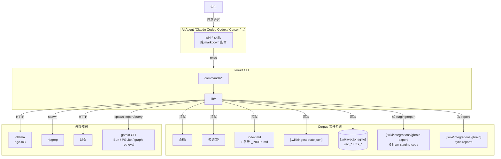
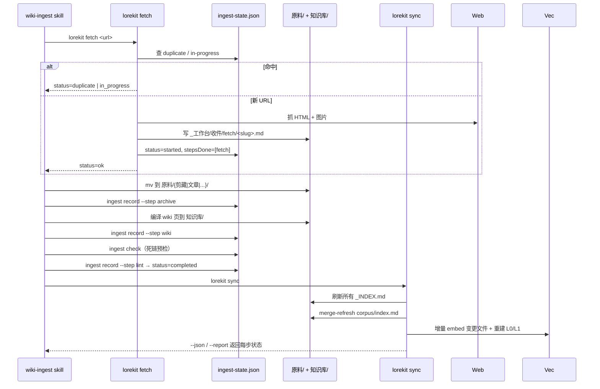
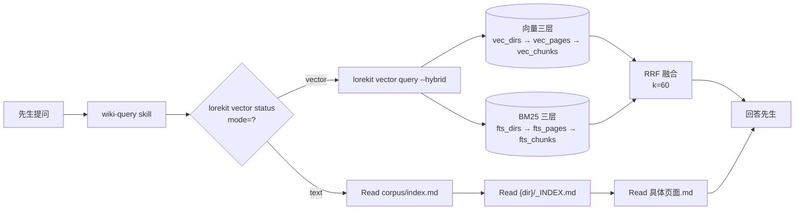
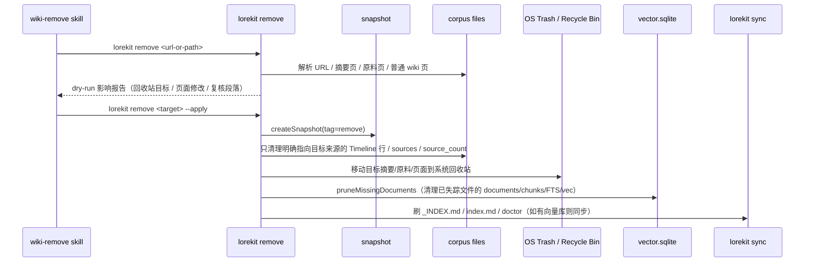
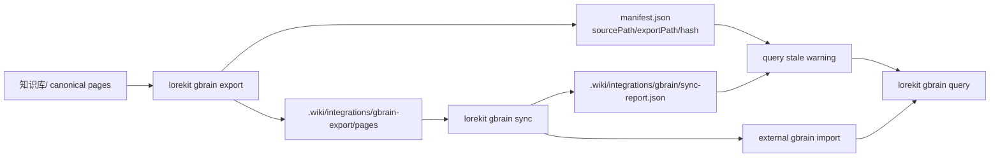

# ARCHITECTURE.md — lorekit 架构

## 设计哲学

源自 [Karpathy 的 LLM Wiki Gist](https://gist.github.com/karpathy/442a6bf555914893e9891c11519de94f)：

- **原料层**（`原料/`）只读，LLM 永不改写
- **知识库层**（`知识库/`）LLM 编译产物，持续更新
- **schema**（`CLAUDE.md` / `AGENTS.md`）人 + LLM 共同维护

CLI 是薄层调度，重逻辑在 skills（agent 侧）。lorekit 自身**不调用 LLM**，只提供文件系统 + 向量库原语。这是 "thin CLI, fat skills" 风格。

## 系统总览

## 核心数据流

### Ingest 流（URL → wiki）

### Query 流（提问 → 答案）

模式切换由 `lorekit vector status` 的 `mode` 字段决定，阈值 `MODE_THRESHOLD_FILES = 100`（按 indexed_files 计数，不按 chunks，跟随 Karpathy 原文 "moderate scale" 定义）。

### Remove 流（来源/页面 → 安全移除）

Remove 的边界是 **provenance-aware**：只按明确来源引用删除，不按关键词删除。例：删除一篇 harness 文章，只移除这篇文章贡献的登记；`知识库/概念/harness.md` 若仍有其他 harness 来源支撑，必须保留。`## Compiled Truth` 不自动改写，只列入人工复核报告。

### GBrain 集成流（wiki → 外部 graph retrieval）

边界：`lorekit gbrain` 只做 read-only bridge。它不修改 `知识库/`，不修改 `原料/`，不把 GBrain 加进 runtime dependencies，也不 vendor GBrain 源码。导出阶段会移除 frontmatter `slug`，让 GBrain 按导出路径生成 slug；同时注入 `lorekit_source_path` / `lorekit_hash` / `lorekit_exported_at` 以便 doctor 检测 stale export。`export --out` 默认只能写到 `.wiki/integrations/` 下，除非显式传 `--allow-outside-corpus`。`query` 默认必须在 corpus 内运行，并先检查 manifest / sync report；若外部索引缺失或 stale，会提醒先 `lorekit gbrain sync`，但不会阻止调用外部 `gbrain query`。

## 核心抽象

| 抽象        | 文件                           | 责任边界                                                                      |
| ----------- | ------------------------------ | ----------------------------------------------------------------------------- |
| Corpus      | `lib/corpus.ts`                | 给一个目录，判定它是不是 corpus（看 `.wiki/` 或 `CLAUDE.md`），向上递归找根   |
| Frontmatter | `lib/corpus.ts`                | gray-matter 包装：`extractFrontmatter` / `hasFrontmatter` / `findSourceByUrl` |
| IngestState | `lib/ingest-state.ts`          | `.wiki/ingest-state.json` 单一事实源；3 个 status × N 个 stepsDone            |
| Fetcher     | `lib/fetcher/`                 | URL → 本地 markdown + 图片；L1 native fetch，L2 playwright fallback（10 文件子模块，v0.4.0 / 批次 21 拆分） |
| Chunker     | `lib/chunker.ts`               | markdown 按 `## heading` 切，加 `[title][type]` prefix                        |
| Ollama      | `lib/ollama.ts`                | 调本地 ollama `/api/embed`                                                    |
| VectorDB    | `lib/vectordb/`                | sqlite-vec + FTS5；queryFlat / queryLayered / queryBM25Layered / queryHybrid（10 文件子模块，v0.4.0 / 批次 22 拆分；批次 24-fix 后 BM25 走 chunk 直查） |
| VectorPrune | `lib/vectordb/prune.ts`        | 删除后清理 vector.sqlite 中磁盘已不存在的 documents 及其 chunks/page summaries/vec/FTS 记录 |
| Remove      | `commands/remove.ts`           | URL/路径解析、dry-run 影响报告、snapshot、OS Trash、来源归因级联清理                    |
| GBrain      | `commands/gbrain.ts` + `lib/integrations/` | 可选只读集成：status/export/sync/doctor/query，外部进程封装、manifest、stale 提醒、安全 export 边界 |
| DoctorReport | `commands/doctor.ts`          | `lorekit doctor --json` / 严格 `--section <name>` 的结构化健康报告；可选集成 warn 不阻塞 corpus |
| SyncReport  | `commands/sync.ts`             | `lorekit sync --json/--report` 的步骤状态收据；写 `.wiki/reports/sync/` |
| RootIndex   | `lib/root-index.ts`            | `corpus/index.md` 的受控区合并刷新（保留人类摘要）                            |
| DirIndex    | `commands/dir-index.ts → runIndex` | 所有子目录 `_INDEX.md` 自动生成（v0.4.0 / 批次 17 从 `commands/index.ts` 改名消歧义） |
| Logger      | `utils/logger.ts`              | 全仓库输出唯一通道（CONVENTIONS 强制）                                        |

## Schema 约束

| 约束                    | 位置                                                | 备注                                                                                |
| ----------------------- | --------------------------------------------------- | ----------------------------------------------------------------------------------- |
| corpus 子目录名（中文） | 散布 lib/commands                                   | `原料` / `知识库` / `_工作台` 等是 schema 决定，**不许动**（CONVENTIONS Do Not #8） |
| 向量库路径              | `<corpus>/.wiki/vector.sqlite`                      | sqlite-vec 虚表 + FTS5 虚表共存于同一文件                                           |
| ingest 状态机           | `started` / `completed` / `failed` × `stepsDone[]`  | 加新 step 只需在 `IngestStep` 枚举里加值，状态枚举不动                              |
| 检索模式阈值            | `MODE_THRESHOLD_FILES = 100`                        | 按 indexed_files 计数，跟随 Karpathy 原文 "moderate scale ~100 sources"             |
| frontmatter 必填字段    | `templates/default-corpus/系统/frontmatter-spec.md` | 由 `lint` 命令检查（`type` / `title` / `slug` / `created` / `updated`）             |

## 外部依赖契约

| 依赖            | 接口                             | 失败降级                                               |
| --------------- | -------------------------------- | ------------------------------------------------------ |
| ollama          | `POST localhost:11434/api/embed` | 抛错；用户去 `ollama serve`。不影响 Read 三层          |
| sqlite-vec      | dynamic import                   | `optionalDependencies`；缺了 vector 命令报错并提示安装 |
| ripgrep         | `spawnSync('rg', ...)`           | fallback 到内置正则扫描                                |
| GBrain          | `spawn('gbrain', ...)`           | 可选；未安装时 `gbrain status/doctor` 给安装建议，`sync/query` 清晰失败 |
| playwright-core | dynamic import                   | 缺了 antibot 站点 fetch 失败并提示装 playwright        |
| tar             | runtime dep                      | snapshot/restore 必需，无 fallback                     |
| trash           | npm package                      | remove 必需；跨平台移动到 OS Trash / Recycle Bin，不走 `rm` |

## 渐进披露的 token 预算

L0（auto-injected, ~2k token）→ L1（on-demand, ~1k/pull）→ L2（targeted）→ L3（向量 fallback）。
单次 query 总 token 通常 < 5k。这是 lorekit 区别于传统 RAG 的关键：检索不是兜底，而是分层渐进。
